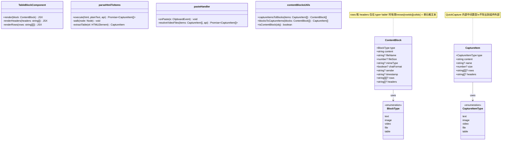
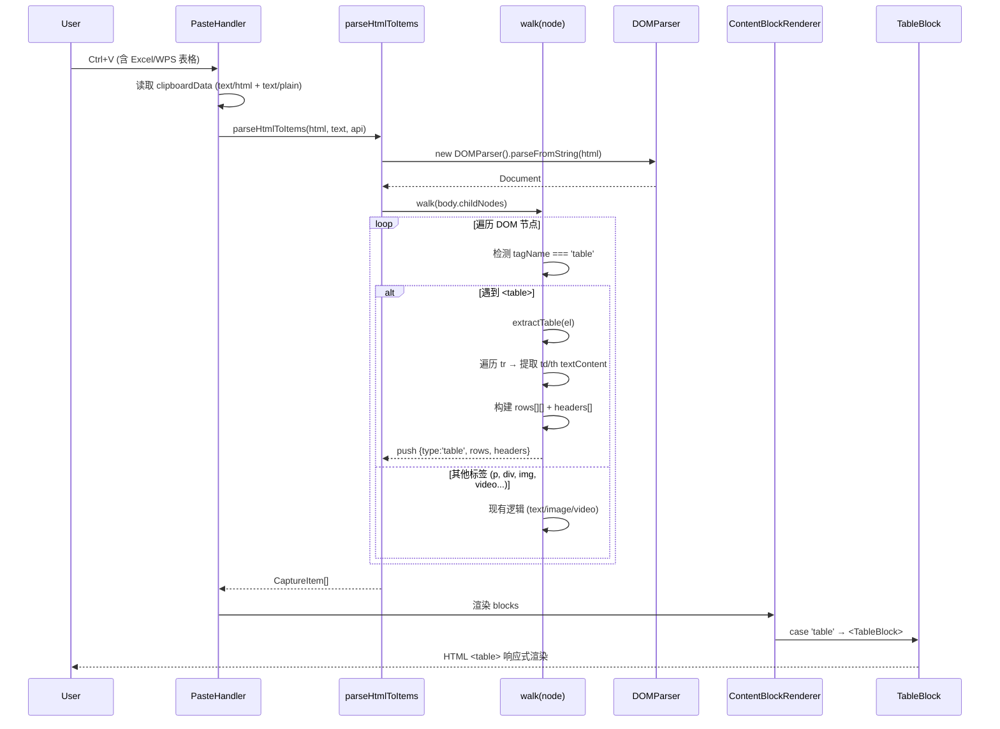
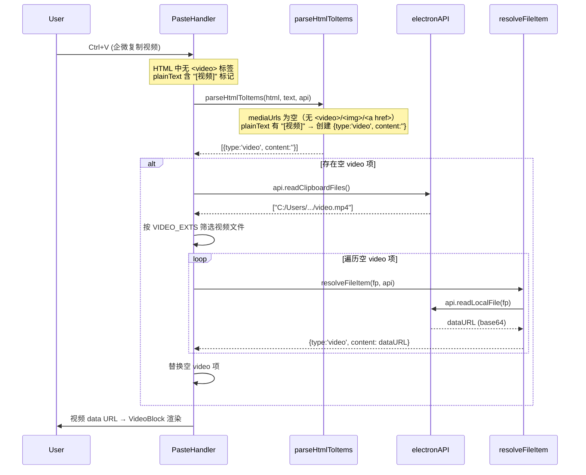
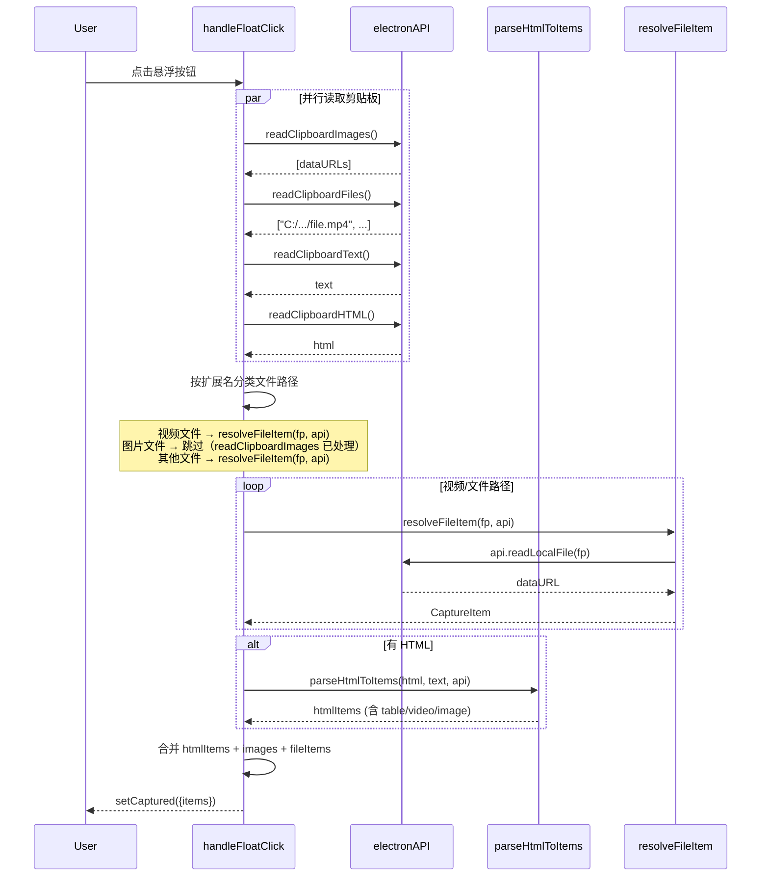
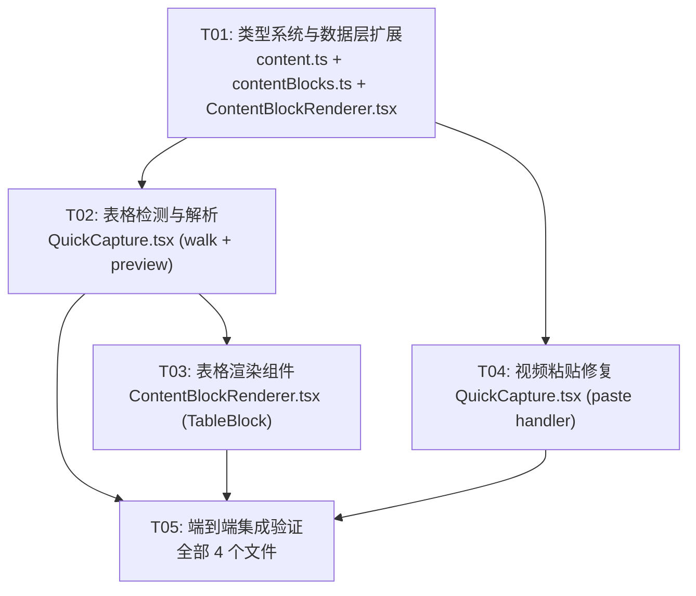

# 剪贴板表格与视频解析修复 — 系统设计方案

> **设计者**: Bob (架构师)  
> **日期**: 2025-07-17  
> **状态**: 待评审  

---

## Part A: 系统设计

### 1. Implementation Approach

#### 核心技术挑战

| 挑战 | 根因 | 方案 |
|------|------|------|
| **表格结构丢失** | `walk()` 递归遍历 DOM 时未识别 `<table>`，单元格文本被当纯文本合并 | 在 walk 中增加 `<table>` 特判，提取 `<tr>/<td>/<th>` 为二维数组 |
| **企微视频无数据** | Ctrl+V 只从 HTML `<video>` 标签和浏览器 blob 提取视频，未调用 `readClipboardFiles()` API | paste handler 在解析后检测空 video item，回调 `readClipboardFiles()` 按扩展名筛选视频文件 |
| **ContentBlock 无 table 类型** | `BlockType` 只有 `text/image/video/file` 四种 | 新增 `'table'` 类型，复用 ContentBlock 的 `rows`/`headers` 可选字段 |

#### 框架与库选择

无需引入新依赖。所有变更基于现有技术栈：
- **React 18 + TypeScript** — 类型系统扩展
- **Tailwind CSS** — 表格响应式样式（`overflow-x-auto`, `border-collapse`）
- **DOMParser** — 浏览器内置，已在使用中
- **Electron `readClipboardFiles` API** — 已在 float button handler 中使用，paste handler 复用

#### 设计原则

1. **最小侵入**：新增 `'table'` 类型不影响现有 `text/image/video/file` 的解析和渲染
2. **向后兼容**：`rows`/`headers` 为可选字段，旧数据反序列化不受影响
3. **DRY**：视频文件解析复用已有的 `resolveFileItem()` 和 `VIDEO_EXTS` 常量
4. **响应式优先**：表格在移动端自动水平滚动，无需 media query

---

### 2. File List

| 文件 | 变更类型 | 说明 |
|------|----------|------|
| `src/types/content.ts` | **修改** | 新增 `'table'` 类型、`rows`/`headers` 字段、更新类型守卫 |
| `src/utils/contentBlocks.ts` | **修改** | `captureItemsToBlocks` / `blocksToCaptureItems` 支持 table 类型 |
| `src/components/QuickCapture.tsx` | **修改** | `CaptureItem` 扩展、`walk()` 表格检测、paste handler 视频回退、预览表格显示 |
| `src/components/ContentBlockRenderer.tsx` | **修改** | 新增 `TableBlock` 组件、switch 增加 `'table'` case |
| `src/components/FileChip.tsx` | **不变** | 无变更 |
| `src/pages/Requirements.tsx` | **不变** | 已通过 `ContentBlockRenderer` 统一渲染，无需修改 |

---

### 3. Data Structures and Interfaces



---

### 4. Program Call Flow

#### 4.1 表格粘贴流程（Ctrl+V / 浮窗采集）



#### 4.2 视频粘贴修复流程（Ctrl+V 企微视频）



#### 4.3 浮窗采集流程（点击悬浮按钮）



---

### 5. Anything UNCLEAR

| 问题 | 假设 | 风险 |
|------|------|------|
| **合并单元格 (colspan/rowspan)** | 当前方案不处理合并单元格，每个 `<td>` 按 DOM 位置放入 grid。如需支持，后续版本可解析 `colspan`/`rowspan` 属性并填充占位单元格 | 低 — 剪贴板数据通常不包含复杂合并 |
| **嵌套表格** | 不处理。`<table>` 内的子 `<table>` 将被忽略（`querySelectorAll('tr')` 只取直接子级） | 极低 — 剪贴板几乎不会有嵌套表格 |
| **表格在 plainText 路径中的位置** | 当有 `plainText` 时，`parseHtmlToItems` 使用文本行驱动解析（第 270-327 行）。表格无纯文本表示，因此当 HTML 含 `<table>` 时，优先使用 HTML-only 解析路径（第 330 行 fallback） | 中 — 需要合理切换：若 HTML 含 table 且有 plainText，应进入 HTML-only 路径或混合路径 |
| **readClipboardFiles 在 paste 事件中的可用性** | `electronAPI.readClipboardFiles()` 在下一次事件循环中可用。paste handler 是异步的，可以 await | 低 — 已验证 float button handler 中可用 |
| **视频文件路径去重** | `readClipboardFiles()` 可能返回与 HTML 中 `<a href="file://...">` 重复的路径。视频修复只处理 `content: ''` 的空 item，不会覆盖已有数据的视频 | 低 |

---

## Part B: 任务分解

### 6. Required Packages

无需新增第三方依赖。所有变更基于现有依赖：

```
- react@^18.x: UI 框架（已有）
- typescript@^5.x: 类型系统（已有）
- tailwindcss@^3.x: 原子化 CSS（已有）
- lucide-react: 图标库（已有，表格渲染不需要新图标）
```

---

### 7. Task List (ordered by dependency)

#### T01 — 类型系统与数据层扩展

| 属性 | 值 |
|------|-----|
| **Task ID** | T01 |
| **Task Name** | 类型系统与数据层扩展 |
| **Source Files** | `src/types/content.ts`, `src/utils/contentBlocks.ts`, `src/components/ContentBlockRenderer.tsx` |
| **Dependencies** | 无 |
| **Priority** | P0 |

**具体工作内容**：

1. **`src/types/content.ts`**:
   - `BlockType` 新增 `'table'`
   - `ContentBlock` 接口新增 `rows?: string[][]`、`headers?: string[]`
   - `isContentBlock()` 类型守卫的 valid types 数组增加 `'table'`

2. **`src/utils/contentBlocks.ts`**:
   - `captureItemsToBlocks()`：当 `item.type === 'table'` 时传递 `rows`、`headers`
   - `blocksToCaptureItems()`：当 `block.type === 'table'` 时传递 `rows`、`headers`
   - （可选）`rebuildBlocksFromLegacy()` 不需要处理 table，纯文本不含表格结构

3. **`src/components/ContentBlockRenderer.tsx`**:
   - 在 switch 语句中新增 `case 'table':` 占位（先渲染 fallback "表格（待实现）"）
   - 确保编译通过，为 T02 做准备

---

#### T02 — 表格检测与解析

| 属性 | 值 |
|------|-----|
| **Task ID** | T02 |
| **Task Name** | 表格检测与解析 |
| **Source Files** | `src/components/QuickCapture.tsx` |
| **Dependencies** | T01 |
| **Priority** | P0 |

**具体工作内容**：

1. **`CaptureItem` 接口扩展**：
   - 类型联合增加 `'table'`
   - 新增 `rows?: string[][]`、`headers?: string[]`

2. **`parseHtmlToItems` — `walk()` 函数表格处理**（第 338-364 行）：
   - 在 `tag === 'video'` 处理之后、`for childNodes` 之前，新增 `tag === 'table'` 分支
   - 实现 `extractTable(el: HTMLTableElement): { rows, headers }`:
     ```ts
     // 1. 查找所有 <tr>
     // 2. 第一个 <tr> 若全是 <th> → 提取为 headers，rows 从第二行开始
     // 3. 其余 <tr> → 提取 td/th textContent → 推入 rows
     // 4. 返回 { rows: string[][], headers?: string[] }
     ```
   - 调用 `items.push({ type: 'table', content: '', rows, headers })` 并 `return`（不递归子节点）

3. **plainText 与 HTML 路径选择优化**（第 270 行附近）：
   - 当 HTML 包含 `<table>` 时，纯文本无法表达表格结构
   - 策略：先检查 HTML 是否含 `<table>`、``、`<video>` 等富媒体标签
   - 若含有富媒体且 plainText 也含 `[图片]`/`[视频]` 标记 → 使用 HTML-only 解析（第 330 行 fallback）
   - 若只有纯文本无富媒体 → 继续使用 text-based 解析（第 270 行）

4. **预览区域表格显示**（第 786-834 行 captured.items.map）：
   - 在循环中增加 `item.type === 'table'` 分支
   - 渲染简易表格预览（与 ContentBlockRenderer 的 TableBlock 共用逻辑或内联简化版）

---

#### T03 — 表格渲染组件

| 属性 | 值 |
|------|-----|
| **Task ID** | T03 |
| **Task Name** | 表格渲染组件 |
| **Source Files** | `src/components/ContentBlockRenderer.tsx` |
| **Dependencies** | T02 |
| **Priority** | P0 |

**具体工作内容**：

1. **新增 `TableBlock` 组件**（在 `FileBlock` 之后、主组件之前）：
   ```tsx
   function TableBlock({ block }: { block: ContentBlock }) {
     const rows = block.rows || [];
     const headers = block.headers || [];
     
     if (rows.length === 0) {
       return <div className="text-xs text-wiki-text3 italic">（空表格）</div>;
     }

     return (
       <div 
         className="overflow-x-auto rounded-md my-1"
         style={{ border: '1px solid var(--wiki-border)' }}
       >
         <table className="w-full text-xs text-wiki-text border-collapse min-w-[200px]">
           {headers.length > 0 && (
             <thead>
               <tr>
                 {headers.map((h, i) => (
                   <th 
                     key={i}
                     className="px-3 py-1.5 text-left font-semibold whitespace-nowrap"
                     style={{ 
                       background: 'var(--wiki-surface2)', 
                       borderBottom: '2px solid var(--wiki-border)' 
                     }}
                   >
                     {h || ' '}
                   </th>
                 ))}
               </tr>
             </thead>
           )}
           <tbody>
             {rows.map((row, ri) => (
               <tr 
                 key={ri}
                 style={{ 
                   background: ri % 2 === 0 ? 'transparent' : 'var(--wiki-surface)' 
                 }}
               >
                 {row.map((cell, ci) => (
                   <td 
                     key={ci}
                     className="px-3 py-1.5 whitespace-nowrap"
                     style={{ 
                       borderBottom: ri < rows.length - 1 ? '1px solid var(--wiki-border)' : 'none' 
                     }}
                   >
                     {cell || ' '}
                   </td>
                 ))}
               </tr>
             ))}
           </tbody>
         </table>
       </div>
     );
   }
   ```

2. **Switch 语句更新**：
   - 将 T01 中的占位 `case 'table':` 替换为 `<TableBlock key={i} block={block} />`

3. **样式要点**：
   - `overflow-x-auto`：小屏水平滚动
   - `whitespace-nowrap`：单元格不换行
   - 斑马纹 (`ri % 2`)：提升可读性
   - `min-w-[200px]`：避免空表格过窄

---

#### T04 — 视频粘贴修复

| 属性 | 值 |
|------|-----|
| **Task ID** | T04 |
| **Task Name** | Paste Handler 视频回退解析 |
| **Source Files** | `src/components/QuickCapture.tsx` |
| **Dependencies** | T01（仅需类型通过编译） |
| **Priority** | P1 |

> 注意：T04 与 T02/T03 独立，可并行开发。

**具体工作内容**：

1. **Ctrl+V paste handler 增强**（第 426-429 行之后）：
   - 在 `parseHtmlToItems` 返回 `newItems` 后、`rawBlobs` 合并前，插入视频回退逻辑
   - 逻辑：
     ```ts
     // 检测空视频项
     const emptyVideoCount = newItems.filter(i => i.type === 'video' && !i.content).length;
     
     if (emptyVideoCount > 0 && api?.readClipboardFiles) {
       try {
         const files: string[] = await api.readClipboardFiles();
         const videoPaths = files.filter(fp => {
           if (!fp) return false;
           const ext = fp.substring(fp.lastIndexOf('.')).toLowerCase();
           return VIDEO_EXTS.includes(ext);
         });
         
         let videoIdx = 0;
         for (let i = 0; i < newItems.length; i++) {
           if (newItems[i].type === 'video' && !newItems[i].content) {
             if (videoIdx < videoPaths.length) {
               const resolved = await resolveFileItem(videoPaths[videoIdx], api);
               if (resolved && resolved.content) {
                 newItems[i] = resolved;
               }
               videoIdx++;
             }
           }
         }
       } catch (err) {
         console.warn('[qc-paste] readClipboardFiles failed:', err);
       }
     }
     ```

2. **兜底日志增强**：
   - 当空 video 项无法解析时，console.warn 输出原因（无文件路径 / readLocalFile 返回 null）

3. **float button handler 已有此逻辑**（第 477-508 行），无需修改，但确认其与 paste handler 逻辑一致性。

---

#### T05 — 集成测试与验证

| 属性 | 值 |
|------|-----|
| **Task ID** | T05 |
| **Task Name** | 端到端集成验证 |
| **Source Files** | `src/types/content.ts`, `src/utils/contentBlocks.ts`, `src/components/QuickCapture.tsx`, `src/components/ContentBlockRenderer.tsx` |
| **Dependencies** | T01, T02, T03, T04 |
| **Priority** | P0 |

**具体工作内容**：

1. **序列化往返测试**：
   - 构造 `{ type: 'table', content: '', rows: [['a','b'],['c','d']], headers: ['H1','H2'] }`
   - `JSON.stringify` → `JSON.parse` → 验证 `isContentBlock() === true`
   - 验证 `captureItemsToBlocks` → `blocksToCaptureItems` 往返不丢失数据

2. **粘贴场景矩阵**：

   | 场景 | 预期 |
   |------|------|
   | Excel 复制 3×3 表格 | CaptureItem type='table', rows 长度 3，每行 3 单元格 |
   | WPS 复制 2×4 表格（有表头） | headers 长度 4，rows 长度 2 |
   | 企微复制视频消息 | type='video', content 非空 dataURL |
   | 企微复制含视频+图片+文本 | 顺序正确：text → image → video |
   | 浏览器复制含 `<table>` 的网页 | 表格正确提取，周围文本不丢失 |
   | 纯文本复制（无 table） | 回归验证，行为不变 |

3. **渲染验证**：
   - ContentBlockRenderer 正确渲染 TableBlock
   - Requirements 详情页（`Requirements.tsx`）通过 `ContentBlockRenderer` 自动支持表格
   - 小屏（<640px）表格水平滚动

4. **边界条件**：
   - 空表格（无 `<tr>` 或无 `<td>`）→ 不创建 table item
   - 单行单列表格 → 正常渲染
   - 含 `<br>` 的单元格 → `textContent` 保持换行

---

### 8. Shared Knowledge

- **所有 Clipboard API 调用通过 `(window as any).electronAPI` 访问**，在浏览器环境下这些方法为 undefined，需做好空值检查
- **`CaptureItem` 是 QuickCapture 内部类型**，不导出；对外统一使用 `ContentBlock`
- **ContentBlock 的 `content` 字段**：对于 `table` 类型，保持空字符串 `''`；实际数据在 `rows`/`headers` 中
- **`VIDEO_EXTS` 常量**：在 `QuickCapture.tsx` 顶部已定义，视频回退逻辑直接使用
- **`resolveFileItem()`**：接收文件路径（或 `file://` URL），调用 `api.readLocalFile()` 读取为 dataURL，返回 `CaptureItem`
- **错误处理策略**：readClipboardFiles/readLocalFile 失败时静默降级（空 video item 保留，用户可看到"视频（无数据）"占位）
- **表格单元格文本**：使用 `textContent` 而非 `innerText`，保持原始空白符（后续可用 `.trim()` 处理）
- **所有日期存储为 ISO 8601 UTC**（项目约定，与本方案无关）

---

### 9. Task Dependency Graph



---

## 附录：变更影响范围

```
                    ┌──────────────────────┐
                    │   QuickCapture.tsx    │
                    │  ┌─────────────────┐  │
                    │  │ CaptureItem      │  │ ← 新增 'table' + rows/headers
                    │  │ parseHtmlToItems │  │ ← walk() 表格检测
                    │  │ paste handler    │  │ ← 视频回退
                    │  │ preview render   │  │ ← 表格预览
                    │  └─────────────────┘  │
                    └──────────┬───────────┘
                               │ captureItemsToBlocks()
                               ▼
                    ┌──────────────────────┐
                    │   contentBlocks.ts   │
                    │  captureItemsToBlocks│ ← 传递 rows/headers
                    │  blocksToCaptureItems│ ← 传递 rows/headers
                    └──────────┬───────────┘
                               │ ContentBlock[]
                               ▼
                    ┌──────────────────────┐
                    │ ContentBlockRenderer │
                    │  TextBlock ✓          │ ← 不变
                    │  ImageBlock ✓         │ ← 不变
                    │  VideoBlock ✓         │ ← 不变
                    │  FileBlock ✓          │ ← 不变
                    │  TableBlock ★         │ ← 新增
                    └──────────────────────┘
                               │
                               ▼
                    ┌──────────────────────┐
                    │   Requirements.tsx   │
                    │  详情页自动支持表格   │ ← 无需修改
                    └──────────────────────┘
```

```
                    ┌──────────────────────┐
                    │   content.ts         │
                    │  BlockType           │ ← + 'table'
                    │  ContentBlock        │ ← + rows? + headers?
                    │  isContentBlock()    │ ← + 'table'
                    └──────────────────────┘
```
