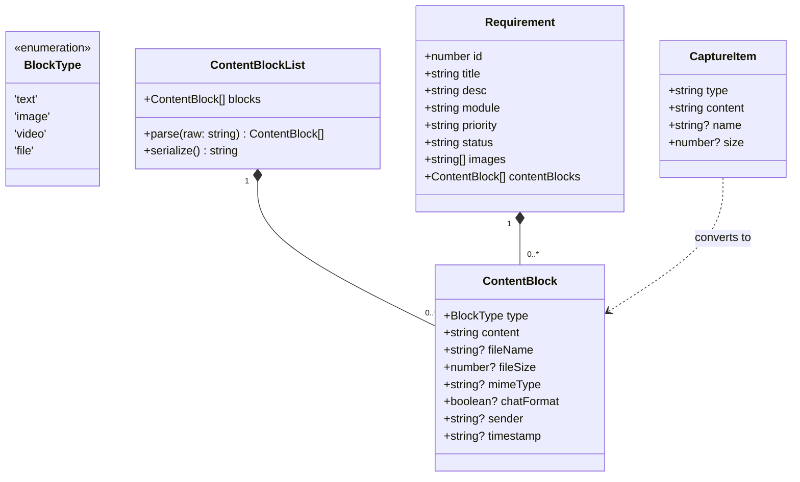
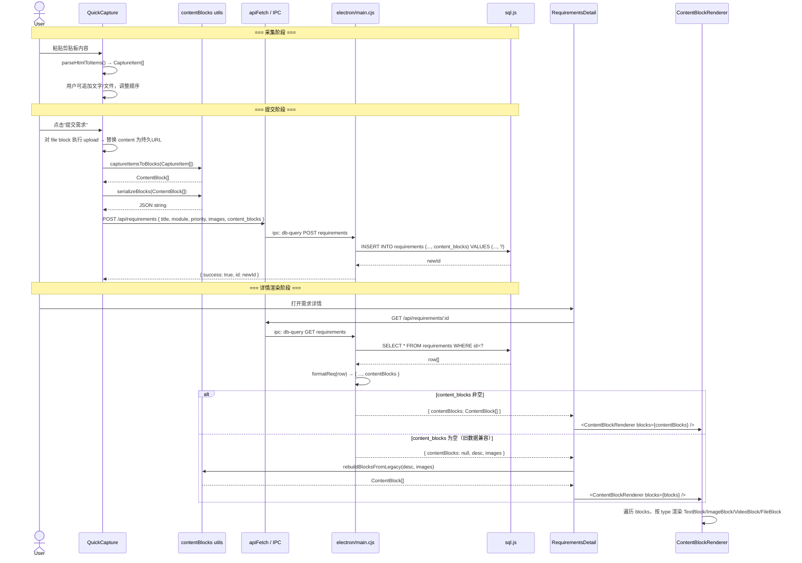
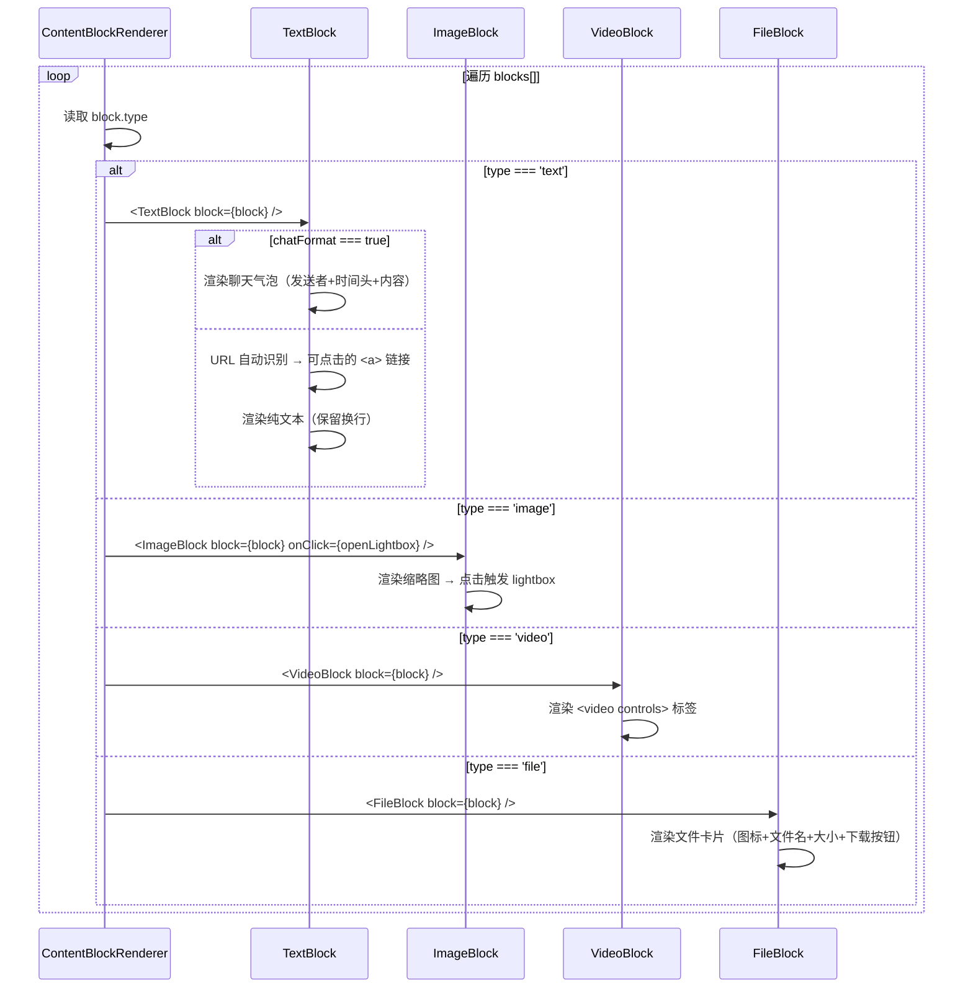
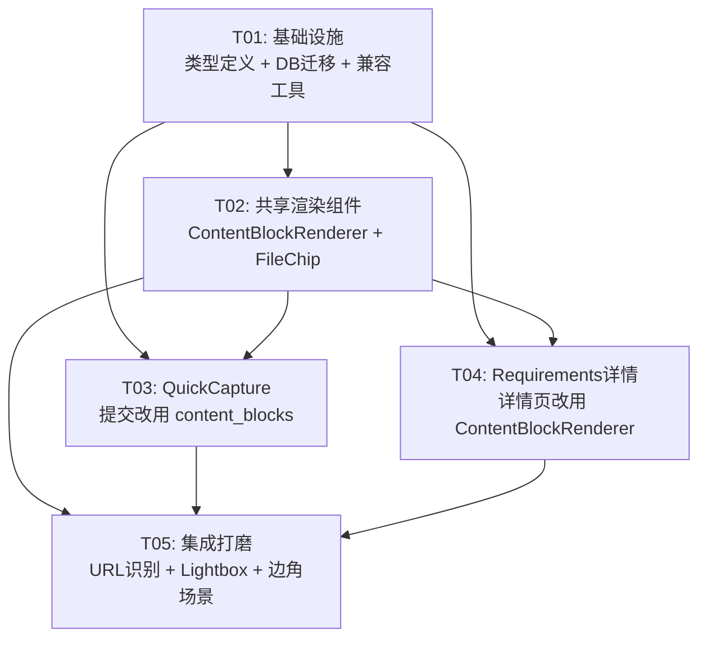

# 统一渲染系统 — 架构设计文档

> **设计师**：高见远 (Bob, Architect)  
> **项目**：workit_unified_render  
> **技术栈**：Electron + React + TypeScript + Vite + sql.js  
> **日期**：2025-07-16

---

# Part A: 系统设计

---

## 1. 实现方案 (Implementation Approach)

### 1.1 核心技术难点

| 难点 | 分析 | 解决方案 |
|------|------|---------|
| **有序内容块存储** | sql.js 无原生 JSON 类型，当前 tags/images 等已用 `TEXT` 存 JSON.stringify | 新增 `content_blocks TEXT DEFAULT '[]'` 列，读写时 JSON.parse/stringify |
| **列索引偏移** | sql.js `CREATE TABLE IF NOT EXISTS` 不修改已存在的表；新增列只能在 ALTER TABLE 时追加到末尾，导致 `formatReq()` 中硬编码列索引 `r[0]~r[18]` 全部偏移 | ALTER TABLE 追加列到末尾（索引 19），`formatReq()` 读取 `r[19]` 并 JSON.parse |
| **采集弹窗与详情页渲染一致** | QuickCapture 和 RequirementsDetail 当前各自实现渲染逻辑，代码重复 ~200 行 | 抽取 `ContentBlockRenderer` 组件，两端共享 |
| **向后兼容** | 存量数据无 `content_blocks` 字段（NULL 或空串 `'[]'`） | `rebuildBlocksFromLegacy()` 工具函数：从 `desc`+`images` 重建 ContentBlock[] |
| **聊天消息保留** | 微信粘贴的对话格式（发送者+时间）需在 content_blocks 中保留 | text block 的 `chatFormat: true` + `sender` + `timestamp` 元数据 |
| **文件上传后的 URL 替换** | QuickCapture 提交时需将 file block 的 dataURL 替换为上传后的持久 URL | 提交时遍历 items，对 `type==='file'` 的 block 先上传后替换 content |

### 1.2 框架与库选择

| 用途 | 选择 | 理由 |
|------|------|------|
| 前端框架 | React 18 + TypeScript | 已有技术栈 |
| 构建工具 | Vite | 已有 |
| 桌面框架 | Electron | 已有 |
| 数据库 | sql.js (SQLite wasm) | 已有，TEXT 存 JSON |
| UI 组件 | lucide-react (图标) + Tailwind CSS | 已有 |
| 类型系统 | TypeScript 接口 + 类型守卫 | 零额外依赖 |

### 1.3 架构模式

采用 **分层架构**：

```
┌────────────────────────────────────┐
│   UI Layer (React Components)      │
│   QuickCapture / Requirements       │
│        ↘        ↙                  │
│   ContentBlockRenderer (共享组件)    │
├────────────────────────────────────┤
│   Data Layer (utils/contentBlocks)  │
│   - blocksToCaptureItems()          │
│   - rebuildBlocksFromLegacy()       │
│   - serializeBlocks()               │
├────────────────────────────────────┤
│   Transport (api.ts / IPC)          │
├────────────────────────────────────┤
│   Backend (electron/main.cjs)       │
│   - DB schema migration             │
│   - CRUD with content_blocks        │
└────────────────────────────────────┘
```

---

## 2. 文件清单 (File List)

```
src/
├── types/
│   └── content.ts                      # [新建] ContentBlock 等类型定义
├── utils/
│   ├── chatParser.ts                   # [不改] 已有聊天解析
│   └── contentBlocks.ts               # [新建] 数据转换/兼容工具函数
├── components/
│   ├── QuickCapture.tsx                # [修改] 提交逻辑改用 content_blocks
│   ├── ContentBlockRenderer.tsx        # [新建] 共享渲染组件（含子模块）
│   └── FileChip.tsx                    # [新建] 提取的文件卡片组件
└── pages/
    └── Requirements.tsx                # [修改] 详情页改用 ContentBlockRenderer

electron/
└── main.cjs                            # [修改] DB迁移 + handleRequirements 增改
```

**文件总数**：4 个新建文件 + 3 个修改文件 = 7 个文件变更

---

## 3. 数据结构与接口 (Data Structures & Interfaces)

### 3.1 类型定义 — `src/types/content.ts`



### 3.2 核心接口详解

```typescript
// === src/types/content.ts ===

/** 内容块类型 */
type BlockType = 'text' | 'image' | 'video' | 'file';

/** 内容块数据 */
interface ContentBlock {
  type: BlockType;
  content: string;        // text内容 / image URL / video URL / file URL(dataURL或持久URL)
  fileName?: string;      // 文件名（file 类型时必填）
  fileSize?: number;      // 文件字节数
  mimeType?: string;      // MIME 类型，用于区分 doc/pdf/zip
  chatFormat?: boolean;   // 是否为聊天消息格式（text 类型可选）
  sender?: string;        // 发送者（chatFormat=true 时）
  timestamp?: string;     // 消息时间（chatFormat=true 时）
}

// === src/utils/contentBlocks.ts ===

/** 从 CaptureItem[] 转为 ContentBlock[]（采集提交用） */
function captureItemsToBlocks(items: CaptureItem[]): ContentBlock[];

/** 从 ContentBlock[] 转为 CaptureItem[]（采集弹窗预览用） */
function blocksToCaptureItems(blocks: ContentBlock[]): CaptureItem[];

/** 从旧 desc + images 重建 ContentBlock[]（向后兼容） */
function rebuildBlocksFromLegacy(desc: string, images: string[]): ContentBlock[];

/** JSON.stringify 安全序列化 */
function serializeBlocks(blocks: ContentBlock[]): string;

/** JSON.parse 安全反序列化 */
function deserializeBlocks(raw: string): ContentBlock[];

/** 判断是否为视频 URL */
function isVideoUrl(url: string): boolean;

/** 判断是否为图片 URL */
function isImageUrl(url: string): boolean;

/** 获取文件扩展名分类 */
function getFileCategory(ext: string): 'image' | 'video' | 'archive' | 'doc' | 'code' | 'file';
```

### 3.3 数据库 Schema 变更

```sql
-- 迁移 SQL（在 initDatabase() 中执行）
ALTER TABLE requirements ADD COLUMN content_blocks TEXT DEFAULT '[]';
```

变更后列索引：

| 索引 | 列名 | 变更前索引 | 说明 |
|------|------|-----------|------|
| 0 | id | 0 | |
| 1 | title | 1 | |
| 2 | description | 2 | |
| 3 | category | 3 | |
| 4 | module | 4 | |
| 5 | priority | 5 | |
| 6 | status | 6 | |
| 7 | assignee | 7 | |
| 8 | creator | 8 | |
| 9 | due_date | 9 | |
| 10 | tags | 10 | |
| 11 | images | 11 | |
| 12 | ai_summary | 12 | |
| 13 | ai_tags | 13 | |
| 14 | image_descriptions | 14 | |
| **15** | **content_blocks** | — | **新增** |
| 16 | workflow_handler | 15 | **偏移** |
| 17 | workflow_history | 16 | **偏移** |
| 18 | created_at | 17 | **偏移** |
| 19 | updated_at | 18 | **偏移** |

---

## 4. 程序调用流 (Program Call Flow)

### 4.1 采集 → 提交 → 存储 → 详情渲染



### 4.2 ContentBlockRenderer 内部渲染决策



---

## 5. 待明确事项 (Anything UNCLEAR)

| # | 问题 | 假设/决策 |
|---|------|----------|
| Q1 | `content_blocks` 列插入位置：PRD 未说明是在 schema 哪两个列之间。由于 sql.js 的 `ALTER TABLE ADD COLUMN` 只能追加到末尾，列索引会在 `image_descriptions`(14) 之后、`workflow_handler`(16变) 之前。 | 追加到末尾，索引 15。`formatReq()` 中 `contentBlocks: JSON.parse(r[15] || '[]')`，后续列索引 +1。 |
| Q2 | QuickCapture 提交时 `desc` 和 `images` 是否仍需维护？ | **是**，PRD 决策"并存过渡"。`desc` 保留纯文本用于搜索兼容，`images` 保留图片 URL 数组用于旧版详情页。 |
| Q3 | ContentBlockRenderer 是单一组件还是文件夹？ | 单一文件 `ContentBlockRenderer.tsx`，内含 `TextBlock`、`ImageBlock`、`VideoBlock`、`FileBlock` 四个内部组件 + 一个导出组件 `ContentBlockRenderer`。不拆成多文件以避免过度碎片化。 |
| Q4 | lightbox 组件是否需要从 QuickCapture 中提取为共享组件？ | 当前两个 lightbox 实现（QuickCapture 行 889-906，Requirements 行 531-537）非常相似但耦合在各自组件中。本次设计在 ContentBlockRenderer 中内联 lightbox 状态管理，通过 `onImageClick` 回调让父组件控制。 |
| Q5 | 视频文件大小限制在何处检查？ | 在 QuickCapture 的 `handleUploadFile` 中已有类型检查。本次追加 `file.size > 100MB` 的前端校验（P1）。 |

---

# Part B: 任务分解

---

## 6. 所需第三方包 (Required Packages)

```
无新增依赖。所有功能基于已有技术栈实现。
```

已有的相关依赖（供参考）：

```
- react@^18.x: UI 框架
- react-dom@^18.x: DOM 渲染
- lucide-react: 图标库
- sonner: Toast 通知
- vite@^5.x: 构建工具
- electron@^28.x: 桌面框架
- sql.js: SQLite wasm
- tailwindcss: CSS 框架
```

---

## 7. 任务列表 (Task List)

### T01 — 基础设施：类型定义 + 数据库迁移 + 兼容工具函数

| 属性 | 值 |
|------|-----|
| **Task ID** | T01 |
| **任务名称** | 类型定义、数据库迁移与向后兼容工具 |
| **源文件** | `src/types/content.ts` (新建), `electron/main.cjs` (修改), `src/utils/contentBlocks.ts` (新建) |
| **依赖** | 无 |
| **优先级** | P0 |

**详细内容**：

1. **`src/types/content.ts`** — 新建
   - 定义 `BlockType`、`ContentBlock` 类型
   - 导出类型守卫函数 `isContentBlock(obj: unknown): obj is ContentBlock`

2. **`electron/main.cjs`** — 修改
   - `initDatabase()`: 追加 `ALTER TABLE requirements ADD COLUMN content_blocks TEXT DEFAULT '[]'`（使用 try/catch 容错已存在列的情况）
   - `formatReq()`: 追加 `contentBlocks: JSON.parse(r[15] || '[]')`，后续 `workflowHandler`、`workflowHistory`、`createdAt`、`updatedAt` 的列索引各 +1
   - `handleRequirements()` → `POST`: 接收 `content_blocks` 字段，`JSON.stringify` 后写入新列
   - `handleRequirements()` → `PUT`: 接收 `content_blocks` 字段，更新时同步写入

3. **`src/utils/contentBlocks.ts`** — 新建
   - `captureItemsToBlocks(items: CaptureItem[]): ContentBlock[]` — 将 QuickCapture 的 `CaptureItem[]` 映射为 `ContentBlock[]`
   - `blocksToCaptureItems(blocks: ContentBlock[]): CaptureItem[]` — 反向映射（QuickCapture 预览需要）
   - `rebuildBlocksFromLegacy(desc: string, images: string[]): ContentBlock[]` — 从旧数据重建：解析 `[附件:name|url]` 标记 → file blocks，text → text blocks，images → image blocks
   - `serializeBlocks(blocks: ContentBlock[]): string` → `JSON.stringify`
   - `deserializeBlocks(raw: string): ContentBlock[]` → 安全 `JSON.parse`（try/catch 返回 `[]`）

---

### T02 — 共享渲染组件：ContentBlockRenderer + FileChip

| 属性 | 值 |
|------|-----|
| **Task ID** | T02 |
| **任务名称** | ContentBlockRenderer 共享组件及其子组件 |
| **源文件** | `src/components/ContentBlockRenderer.tsx` (新建), `src/components/FileChip.tsx` (新建), `src/types/content.ts` (只读引用) |
| **依赖** | T01 |
| **优先级** | P0 |

**详细内容**：

1. **`src/components/FileChip.tsx`** — 新建（从 QuickCapture 提取共享）
   - 从 `QuickCapture.tsx` 提取 `FileChip` 组件（当前行 127-146）及其依赖的 `getFileExt`、`getFileCategory`、`formatFileSize`、文件扩展名常量
   - Props: `{ fileName: string; fileSize?: number; mimeType?: string; onRemove?: () => void; onClick?: () => void }`
   - 保留 `data-cmp="FileChip"` 属性用于组件追踪
   - 支持两种模式：`onRemove` 出现时显示删除按钮（采集弹窗），否则显示为可点击下载卡片（详情页）

2. **`src/components/ContentBlockRenderer.tsx`** — 新建
   - Props: `{ blocks: ContentBlock[]; onImageClick?: (index: number) => void; imageList?: string[]; chatFormat?: boolean; senderColorMap?: Map<string, string> }`
   - 内部子组件：
     - `TextBlock` — 渲染纯文本/聊天气泡，URL 自动链接化
     - `ImageBlock` — 渲染缩略图，点击触发 `onImageClick`
     - `VideoBlock` — 渲染 `<video controls>` 标签
     - `FileBlock` — 使用 `<FileChip>` 渲染文件卡片
   - `data-cmp="ContentBlockRenderer"` 属性
   - 支持 `chatFormat` 模式：text block 若 `chatFormat: true` 则渲染为聊天气泡（左对齐，发送者名+时间头+内容区）

3. **`src/types/content.ts`** — 引用
   - 此文件在 T01 中创建，T02 仅 `import` 使用

---

### T03 — QuickCapture 提交流改用 content_blocks

| 属性 | 值 |
|------|-----|
| **Task ID** | T03 |
| **任务名称** | QuickCapture 提交改用 content_blocks |
| **源文件** | `src/components/QuickCapture.tsx` (修改), `src/utils/contentBlocks.ts` (修改), `src/components/FileChip.tsx` (引用), `electron/main.cjs` (已在T01修改) |
| **依赖** | T01, T02 |
| **优先级** | P0 |

**详细内容**：

1. **`src/components/QuickCapture.tsx`** — 修改
   - `handleSubmit()`: 
     1. 遍历 `captured.items`，对 `type==='file'` 的 item 先上传获取持久 URL，替换 content
     2. 调用 `captureItemsToBlocks(items)` → `ContentBlock[]`
     3. POST body 新增 `content_blocks: JSON.stringify(blocks)`
     4. 保留 `desc` (纯文本) 和 `images` (图片URL数组) 用于搜索兼容
   - 预览区域可考虑使用 ContentBlockRenderer 替代当前内联渲染（可选优化，不强求）

2. **`src/utils/contentBlocks.ts`** — 追加函数
   - `extractTextFromBlocks(blocks: ContentBlock[]): string` — 提取纯文本（用于 desc 兼容字段）
   - `extractImagesFromBlocks(blocks: ContentBlock[]): string[]` — 提取图片 URL（用于 images 兼容字段）

3. **`src/components/FileChip.tsx`** — 引用
   - QuickCapture 中使用 FileChip 替代内联 FileChip 实现（消除重复代码）

---

### T04 — Requirements 详情页改用 ContentBlockRenderer

| 属性 | 值 |
|------|-----|
| **Task ID** | T04 |
| **任务名称** | 需求详情页改用 content_blocks 渲染 |
| **源文件** | `src/pages/Requirements.tsx` (修改), `src/components/ContentBlockRenderer.tsx` (引用), `src/utils/contentBlocks.ts` (引用) |
| **依赖** | T01, T02 |
| **优先级** | P0 |

**详细内容**：

1. **`src/pages/Requirements.tsx`** — 修改
   - `Requirement` 接口新增 `contentBlocks?: ContentBlock[]`
   - 详情视图中的"需求描述"区域：
     - 判断 `detailReq.contentBlocks && detailReq.contentBlocks.length > 0`
       - 是 → 使用 `<ContentBlockRenderer blocks={contentBlocks} ... />` 渲染
       - 否 → 调用 `rebuildBlocksFromLegacy(detailReq.desc, detailReq.images)` → `<ContentBlockRenderer>` 渲染
   - 聊天消息检测：将 `parseChatMessages` 结果传入 ContentBlockRenderer
   - 图片 lightbox：`onImageClick` 回调设置 `previewImage` / `previewIdx`
   - 删除旧的 text/images/attachments 分开渲染代码（行 460-526）

2. **`src/components/ContentBlockRenderer.tsx`** — 集成
   - 处理详情页特有的交互（lightbox 回调、文件下载点击）

3. **`src/utils/contentBlocks.ts`** — 引用
   - 调用 `rebuildBlocksFromLegacy()` 处理旧数据

---

### T05 — 集成打磨：URL 识别、Lightbox 一致性、边角场景

| 属性 | 值 |
|------|-----|
| **Task ID** | T05 |
| **任务名称** | 集成打磨与边角场景处理 |
| **源文件** | `src/components/ContentBlockRenderer.tsx` (修改), `src/components/QuickCapture.tsx` (修改), `src/pages/Requirements.tsx` (修改) |
| **依赖** | T03, T04 |
| **优先级** | P1 |

**详细内容**：

1. **`src/components/ContentBlockRenderer.tsx`** — 增强
   - TextBlock 内 URL 自动识别：正则 `/(https?:\/\/[^\s]+)/g` 匹配 → `<a>` 标签渲染
   - ImageBlock lightbox 集成：组件内维护 `lightboxIndex` state，支持左右箭头切换、ESC 关闭
   - VideoBlock：添加 `controlsList="nodownload"` 防止直接下载（可选），文件大小提示
   - FileBlock：点击下载按钮 → `<a href download>` 触发浏览器下载

2. **`src/components/QuickCapture.tsx`** — 预览区对齐
   - 预览区改用 `ContentBlockRenderer` 渲染（确保采集弹窗看到的内容与详情页完全一致）
   - 保留 removeItem 功能通过回调处理

3. **`src/pages/Requirements.tsx`** — 清理
   - 删除旧渲染路径中不再使用的 import（`FileTextIcon`、`ArchiveIcon`、`CodeIcon` 等可能仍需保留）
   - 确保向后兼容路径测试通过（旧数据无 content_blocks 时的渲染）

---

## 8. 共享知识 (Shared Knowledge)

```
1. 所有 API 响应使用 { success: true, data } 或 { error: string } 格式（已有约定）
2. sql.js 无 JSON 列类型，所有结构化数据用 TEXT 列存 JSON.stringify，读取时 JSON.parse
3. content_blocks 空值统一为 '[]'（空数组的 JSON 串），不含 null/undefined
4. 向后兼容路径：content_blocks 为空或 '[]' 时自动从 desc + images 重建，不报错
5. 所有 React 组件使用 data-cmp 属性标记组件名，用于 DOM 追踪和调试
6. 文件上传 URL 格式：/uploads/{timestamp}-{random}.bin → 通过 Express 静态路由提供
7. 颜色系统使用 CSS 变量（--wiki-text, --wiki-bg, --wiki-surface 等），不硬编码颜色值
8. 日期存储格式：ISO 8601 UTC（已有约定）
9. 聊天消息格式检测：至少 2 行匹配 "姓名 空格 日期 时间" 格式才视为聊天消息（chatParser.ts 已有）
10. 文件类型判断：基于扩展名，定义在 src/components/QuickCapture.tsx 的常量中（迁移到 FileChip.tsx 共享）
```

---

## 9. 任务依赖图 (Task Dependency Graph)



**依赖分析**：
- T01 是唯一无依赖的任务，必须最先执行
- T02 仅依赖 T01（类型定义），可与 T03/T04 部分并行
- T03 和 T04 都依赖 T01+T02，但彼此之间无依赖，可并行执行
- T05 是收尾任务，依赖所有前置任务完成后执行

---
